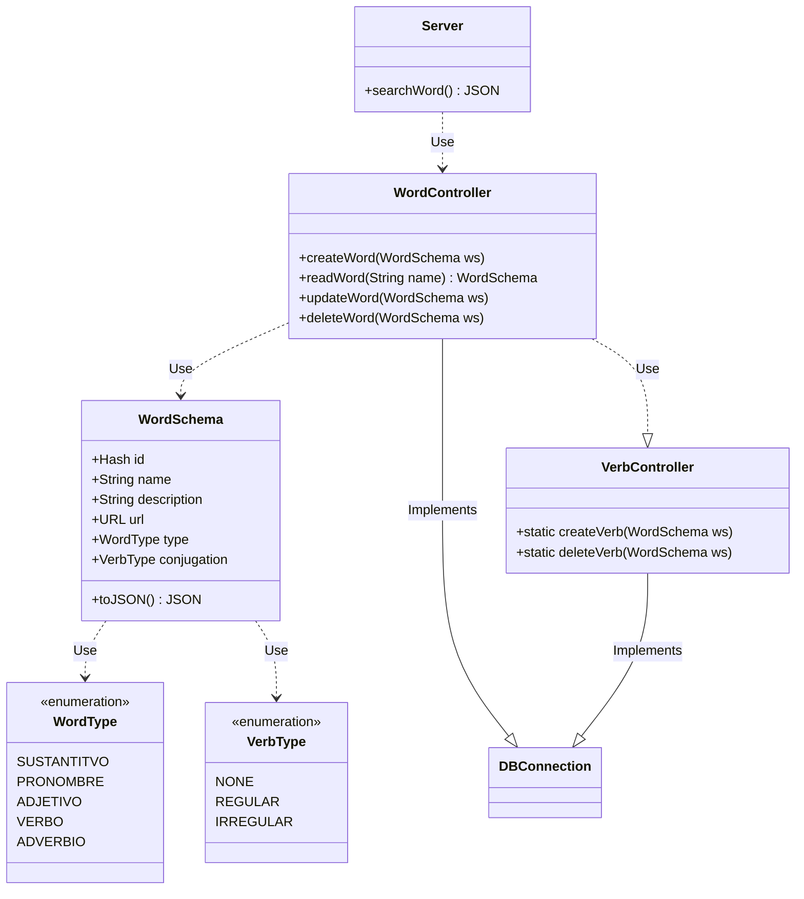

# Class diagram

## Server

```mermaid
classDiagram

WordSchema ..> WordType: Use
WordSchema ..> VerbType: Use
WordController ..> WordSchema: Use
WordController --|> DBConnection: Implements
VerbController --|> DBConnection: Implements
WordController ..|> VerbController: Use
Server ..> WordController: Use

class WordType {
    <<enumeration>>
    SUSTANTITVO
    PRONOMBRE
    ADJETIVO
    VERBO
    ADVERBIO
}

class VerbType {
    <<enumeration>>
    NONE
    REGULAR
    IRREGULAR
}

class WordSchema {
    +Hash id 
    +String name
    +String description
    +URL url
    +WordType type
    +VerbType conjugation
    +toJSON() JSON
}

class WordController {
    +createWord(WordSchema ws)
    +readWord(String name) WordSchema
    +updateWord(WordSchema ws)
    +deleteWord(WordSchema ws)
}

class VerbController {
    +static createVerb(WordSchema ws)
    +static deleteVerb(WordSchema ws)
}

class Server {
    +searchWord() JSON
}
```